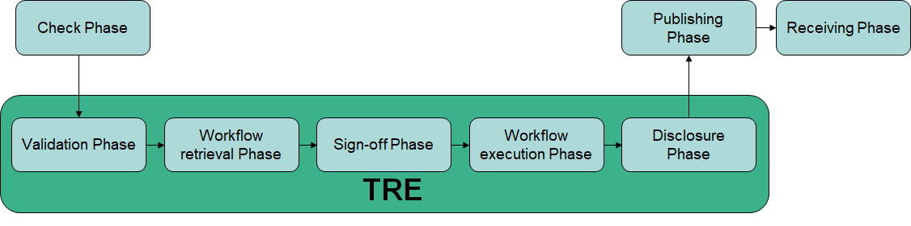

# TRE-FX Five Safes RO-Crate profile 

_Five Safes RO-Crate_ <https://w3id.org/5s-crate/> specifies a profile of [RO-Crate](https://w3id.org/ro/crate) for the purpose of workflow execution in a distributed trusted research environment (TRE). 

The profile is being developed by the [TRE-FX](https://trefx.uk/) project.

## Cite as

Stian Soiland-Reyes, Stuart Wheater, Thomas Giles, Carole Goble, Philip Quinlan (2023):  
**TRE-FX Technical Documentation - Five Safes RO-crate**.  
_Zenodo_  
<https://doi.org/10.5281/zenodo.10376350>

## Profile releases

Current release:
* [Five Safes RO-Crate profile 0.4](https://w3id.org/5s-crate/0.4)

Next draft in progress:
* [Five Safes RO-Crate profile 0.5-DRAFT](0.5-DRAFT/)

Archived drafts:
* [Five Safes RO-Crate profile 0.4-DRAFT](0.4-DRAFT/)
* [Trusted Workflow Run Crate profile 0.3](https://w3id.org/trusted-wfrun-crate/0.3)
(now renamed to _Five Safes RO-Crate_)
* [Five Safes Crate 0.2-DRAFT](0.2-DRAFT/) 
* [Five Safes Crate 0.1-DRAFT](0.1-DRAFT/)

## About Five Safes RO-Crate

A Five Safes RO-Crate represents a unit of computational workflow-based access to sensitive information which is managed in accordance with a set of principles conforming to the Five Safe framework, a well-established model for managing access to confidential or sensitive data. The aim is to enable trusted workflow execution in a Trusted Research Environment (TRE), from an authenticated workflow run request, through approval and review processes to a completed workflow execution. The profile has been developed for the purpose of TRE-FX implementation of workflow execution in a distributed TRE. The Five Safes RO-Crate is a specialised profile of RO-Crate, whereby encapsulated elements and metadata provide the necessary context for evaluating the safety and appropriateness of both data access and analysis. 

> **Note**: A crate that is compliant to the  Five Safes RO-Crate profile is not inherently safe  - its role is to streamline the flow of information by standardising the metadata it collects and carries. That metadata is used to support the Five Safes processes of the TREs and their issuing/receiving clients.
> A Five Safes RO-Crate operates in a pre-determined and controlled context: (i) the workflow that is to be executed within the TRE to answer a request has already pre-approved by the TRE and will be executed in a secure deployment and (ii) the services to implement the crate phases  are secure and adhere to the Five Safes." %}

[RO-Crate](https://w3id.org/ro/crate) is a community-based specification for packaging and describing research outputs, based on FAIR linked data standards. The approach has been adopted by a variety of research domains with specialisation in different profiles to combine generic and domain-specific metadata. Recently, the [Workflow Run Crate](https://w3id.org/ro/wfrun/) profiles have been developed and are being implemented by more than 6 workflow engines including CWL and Galaxy.

The [Five Safes model](https://ukdataservice.ac.uk/help/secure-lab/what-is-the-five-safes-framework/) provides a structured approach to managing confidential or sensitive data through five dimensions: Safe Data, Safe Projects, Safe People, Safe Settings, and Safe Outputs. For data controllers operating Trusted Research Environments (TREs), ensuring compliance with data governance and legal frameworks is critical, especially in the context of federated analytics. 

The Five Safes RO-Crate aims to provide a mechanism to encapsulate data, workflows, and provenance with extensible metadata in a standardised, compliant package, and hence improve the flow of the metadata, queries and results necessary to streamline TRE operations, enable rigorous compliance, and enhance data integrity and security.

The initial crate with a workflow run request references a pre-approved workflow and project details for manual and automated assessment according to the TRE’s agreement policy for the sensitive dataset. The crate goes through multiple phases internal to the TRE, including validation, sign-off, workflow execution and disclosure control. At this later stage the crate is also conforming to the Workflow Run Crate profile for return to the user, and a derived public version (possibly redacted) can be published in data use registers to document the analysis.

## Phases of Five Safes RO-Crate

The phases a Five Safes RO-Crate is expected to go through includes:

* Check Phase -- the crate is checked for integrity and completeness before passing to the TRE
* Validation Phase -- The crate metadata is checked for validity according to the profile
* Workflow Retrieval Phase -- TRE retrieves the requested workflow, typically from a local proxy of pre-approved workflows
* Sign-off Phase -- TRE verififies the requesting user/project is permitted to execute given workflow on the TRE's data. This may include manual inspection e.g. selection criteria in input parameters.
* Workflow Execution Phase -- TRE records execution of the workflow using a workflow engine, recording results and any errors.
* Disclosure Phase -- The Crate goes through disclosure control before leaving the TRE -- this may be manual or semi-automatic depending on the workflow. 
* Publishing Phase -- The Crate is made ready for publishing outside of the TRE and delivery to the user and data usage registers.
* Receiving Phase -- The client or data usage register may check the returned Crate for completeness of the above phases and record this.

Each phase is recorded within the Crate with timestamps and responsible agents, even within the TRE. It is possible to fail some phases, e.g. a failed Disclosure Phase will return a Crate with no output data. Some phases may be performed either inside or outside the TRE depending on local requirements (e.g. Validation Phase). 

## Licence

* © Copyright 2023 The University of Manchester and contributors
* Licence: [MIT Licence](https://spdx.org/licenses/MIT)

## Feedback

For feedback or suggested changes, feel free to raise a GitHub Issue or Pull Request:
<https://github.com/trefx/5s-crate/>
